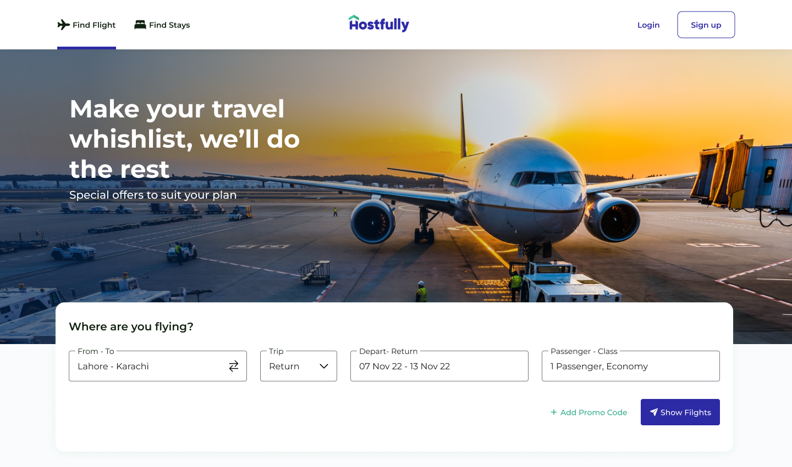

# React Booking Application

## Overview

Welcome to the React Booking Application! This web application allows users to manage property bookings efficiently. It was developed as part of a technical test for a senior React developer position. The application is built using React 18, Node 20, TypeScript, and Sass.

## Features

### 1. Create a Booking

Users can easily create a new booking by selecting a start and end date for their reservation on a property.

### 2. Read a Booking

View and retrieve information about existing bookings, including details such as start and end dates.

### 3. Update a Booking

Modify the details of an existing booking, such as adjusting the start or end date.

### 4. Delete a Booking

Remove a booking from the system when it's no longer needed.

## Technologies Used

- React 18
- Node 20
- TypeScript
- Sass

## Global State Management

The application utilizes a global state store to manage the state of bookings. The specific global state management library used is of your choice.

## Validation & User Experience

To enhance user experience, the application incorporates logic to prevent double bookings (overlapping reservations). Additionally, the start and end dates for each booking are validated to ensure accuracy.

## Responsive Design

The webpages are designed to be fully responsive, providing a seamless experience for users on both desktop and mobile devices.

## Prototype and Demo

- [Prototype](https://www.figma.com/file/bjNprSTqV2YWBYemPHkJAH/Hostfully-Challenge?type=design&node-id=70-1539&mode=design)
- [Demo](https://hostfully-challenge.netlify.app/)

## Next Steps

While the current version of the React Booking Application fulfills the basic requirements outlined in the technical test, there are several opportunities for further improvement and expansion:

1. **User Authentication**: Implement user authentication to secure the booking management system and provide personalized experiences for users.

2. **Enhanced Validation**: Extend validation logic to handle edge cases and provide more informative error messages to users.

3. **Additional Features**: Consider adding features such as search functionality, sorting, and filtering to enhance the overall usability of the application.

4. **Improved Styling**: Enhance the visual appeal of the application by refining the styling and incorporating modern design principles.

5. **Testing**: Implement comprehensive testing to ensure the robustness and reliability of the application.

## Getting Started

To run the React Booking Application locally, follow these steps:

1. Clone the repository.
2. Install dependencies using `npm install`.
3. Start the development server using `npm run dev`.

Feel free to explore the codebase, contribute to the project, and make it even better!

Thank you for taking the time to complete this test, and best of luck with your application!

---

## Additional Questions

### 1. The most challenging technical problem in my career:

During the development of the Design System for Caixa Econômica Federal, one of the largest banks in Latin America, I faced the challenge of leading the creation of a comprehensive component library. The complexity of this project lay in the need to establish not only design and development standards but also ensure accessibility for a diverse audience of over 40 million customers.

What made it particularly difficult was the need to carefully consider design guidelines, sustainable development practices, and critical accessibility issues. To overcome these challenges, we adopted a collaborative approach, involving the team in regular discussions and review sessions to ensure that all perspectives were considered. Additionally, constant research and updates on industry best practices were crucial to the project's success.

### 2. Ideal Tech Stack:

My choice of an ideal tech stack varies based on the specific project requirements, but I have a strong familiarity with technologies such as React.js for the frontend, using Sass for styling. On the backend, my experience spans Node.js or PHP, paired with relational databases. I lean more towards frontend development, where my experience is more extensive, but I am equally comfortable contributing to backend decisions.

### 3. Code Quality Assurance:

Ensuring high code quality is an ongoing priority. I employ a comprehensive approach that includes code review processes, pair programming practices, and automated testing. I follow the testing pyramid philosophy, where the base consists of unit tests, followed by integration tests, and finally end-to-end tests. This strategy provides robust and effective coverage to ensure code stability and reliability.

### 4. Priorities in Code Reviews:

When conducting code reviews, my primary focus includes:

- **Readability and Maintainability**: Ensuring the code is clear, concise, and follows coding best practices to facilitate future maintenance.

- **Compliance with Coding Standards**: Verifying that the code adheres to established coding standards, ensuring consistency throughout the project.

- **Efficiency and Performance**: Evaluating whether the code is efficient and meets defined performance requirements.

- **Security**: Ensuring the code follows recommended security practices to prevent vulnerabilities.

- **Constructive Feedback**: Providing constructive feedback, fostering a continuous learning environment for the entire team.

These practices not only guarantee code quality but also contribute to a healthy and collaborative development environment.
